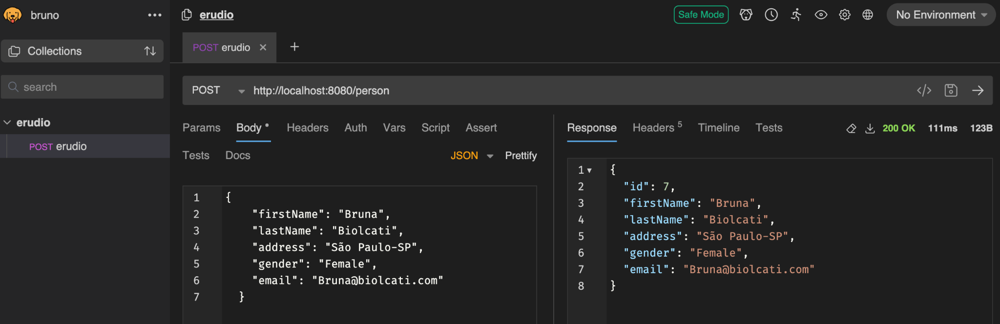
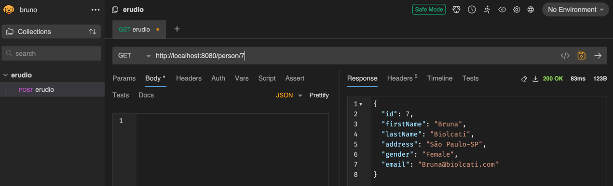
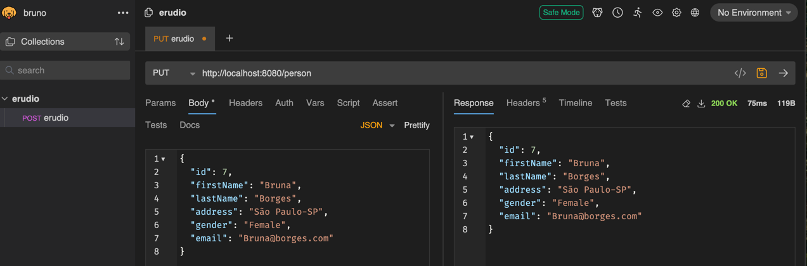
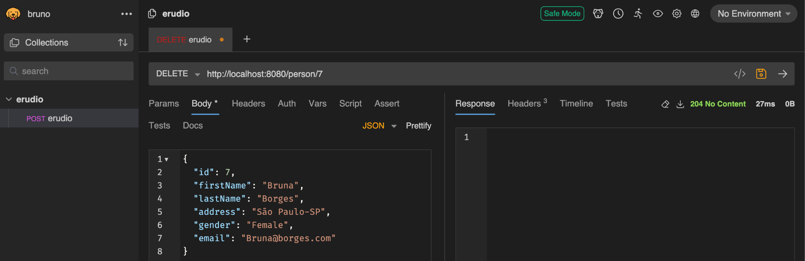
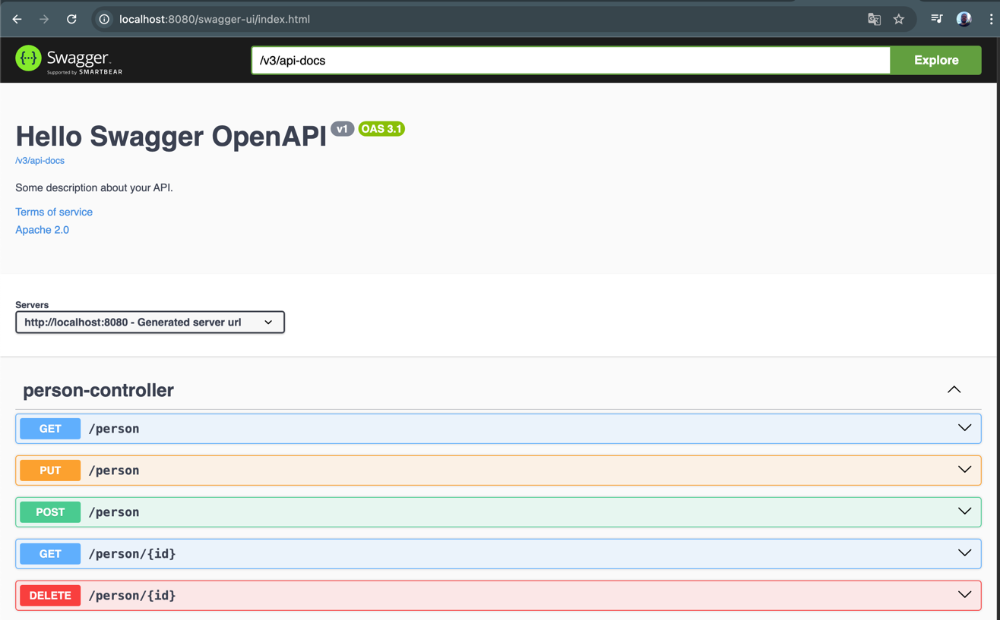
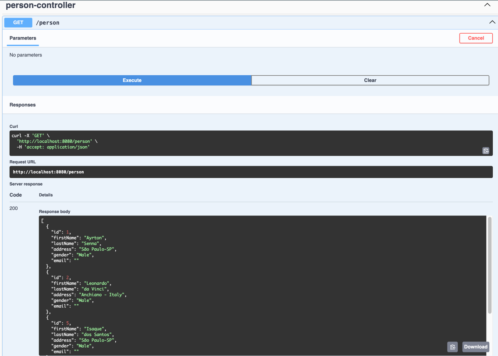

## 🚀 Objetivos do Curso
Este **README** é baseado no curso de **"Desenvolvimento de Aplicações Java com Spring Boot"**, focado na criação e execução de **Testes Unitários** e de **Integração** para aplicações Java utilizando o **Spring Boot 3**. A jornada inclui o uso de ferramentas como **JUnit 5**, **Mockito**, **TestContainers**, **TDD (Desenvolvimento Orientado a Testes)** e **Swagger** para documentar e testar os **endpoints** da **API.**

_______________________________________________________________________________________________________________________

Ao longo deste README, vou detalhar todos os passos necessários para desenvolver e testar a aplicação de maneira eficaz. O objetivo é não apenas ensinar como aplicar as ferramentas mencionadas, mas também mostrar as melhores práticas para garantir que a aplicação tenha uma alta cobertura de testes e seja robusta em termos de qualidade e funcionalidade.
_______________________________________________________________________________________________________________________

## 🛠️ Ferramentas Utilizadas

### Spring Boot 3
O Spring Boot 3 é um framework baseado no Spring Framework, projetado para facilitar o desenvolvimento de aplicações Java, eliminando grande parte da configuração manual. Ele oferece inicialização rápida, configuração automática e um ecossistema robusto para a criação de microsserviços e APIs REST.

A versão Spring Boot 3 traz suporte aprimorado para Jakarta EE, compatibilidade com Java 17+, melhorias de desempenho e suporte nativo para GraalVM, permitindo a criação de aplicações mais eficientes e escaláveis.
### JUnit 5
JUnit 5 é um framework de testes para Java que oferece suporte para testes unitários e integração. Com o JUnit, podemos criar testes automatizados para garantir que o código da aplicação funcione corretamente.

### Mockito
Mockito é uma ferramenta para criar **mocks** e **stubs** de objetos, permitindo que possamos testar a lógica da aplicação sem depender de implementações externas.

### TestContainers
O TestContainers permite que você use containers Docker para testes. Ao invés de depender de bancos de dados ou outras dependências em memória, podemos criar containers temporários para testar a aplicação de forma mais realista.

### Swagger
Swagger é uma ferramenta de documentação de APIs que cria uma interface gráfica onde você pode testar seus endpoints diretamente do navegador.

Além disso, utilizaremos a abordagem **TDD (Test-Driven Development)**, que incentiva a escrita de testes antes da implementação do código. Essa prática melhora a qualidade do software, aumenta a cobertura de testes e reduz a ocorrência de bugs ao longo do desenvolvimento.


O objetivo deste README é consolidar o aprendizado, explicando como configurar, desenvolver e testar uma aplicação usando essas ferramentas e práticas.
________________________________________________________________________________________________________________________

# 🔧 Configuração do Ambiente

Para configurar o ambiente de testes em uma aplicação Spring Boot 3, vamos começar pela criação do projeto até a configuração do arquivo `pom.xml` com as dependências necessárias.

## Passo 1: Criação do Projeto Spring Boot 3 com o Spring Initializr

A maneira mais fácil de começar um projeto Spring Boot é usar o [Spring Initializr](https://start.spring.io/), uma ferramenta online que gera o esqueleto do projeto com as dependências necessárias.
_______________________________________________________________________________________________________________________
### Configuração do Projeto

Preencha as opções conforme descrito abaixo:

- **Project**: Escolha "Maven Project".
- **Language**: Selecione "Java".
- **Spring Boot**: Certifique-se de estar usando a versão mais recente do Spring Boot 3.
- **Group**: Informe o nome do grupo do seu projeto, como `com.exemplo`.
- **Artifact**: Dê um nome ao seu artefato, como `meu-projeto`.
- **Packaging**: Selecione "Jar".
- **Java**: Escolha a versão do Java que você está utilizando (Java 17 ou superior é recomendado).

### Seleção de Dependências

As dependências devem ser escolhidas conforme a necessidade do seu projeto. Neste, utilizaremos as seguintes:
- **Spring Web**: Para criar APIs RESTful.
- **Spring Data JPA**: Para interagir com bancos de dados relacionais.
- **H2 Database**: Para usar um banco de dados em memória, útil para testes.
- **Spring Boot Test**: Inclua essa dependência para testes unitários e de integração.

### Gerar o Projeto

1. Clique em "Generate" para baixar o arquivo `.zip`.
2. Extraia o arquivo e abra o projeto no seu IDE favorito.

## Passo 2: Confirmação e Adição de Dependências no pom.xml
Após criar o projeto usando o Spring Initializr e escolher as dependências iniciais, abra o arquivo **pom.xml** e verifique se as dependências necessárias para o ambiente de testes estão presentes. Se necessário, adicione dependências adicionais para atender aos requisitos do seu projeto.
```xml
<dependencies>
  <!-- Spring Boot Test -->
  <dependency>
    <groupId>org.springframework.boot</groupId>
    <artifactId>spring-boot-starter-test</artifactId>
    <scope>test</scope>
  </dependency>

  <!-- RestAssured para testes de API -->
  <dependency>
    <groupId>io.rest-assured</groupId>
    <artifactId>rest-assured</artifactId>
    <scope>test</scope>
  </dependency>

  <!-- TestContainers para testes de integração -->
  <dependency>
    <groupId>org.testcontainers</groupId>
    <artifactId>testcontainers</artifactId>
    <scope>test</scope>
  </dependency>
</dependencies>
```
Agora vamos entender o que cada uma dessas dependências faz.

### 1. **Spring Boot Starter Test** (`spring-boot-starter-test`)

Esta dependência é essencial para realizar testes no Spring Boot. Ela inclui várias ferramentas importantes para testar a aplicação, como JUnit, Mockito, Hamcrest, e Spring Test. Com ela, você tem suporte para:

- **Testes de unidade**: Como testar componentes individuais da aplicação, como serviços e repositórios.
- **Testes de integração**: Como realizar testes mais completos que envolvem o contexto do Spring Boot, como o banco de dados, endpoints REST e muito mais.
- **Testes Web**: Inclui suporte para realizar testes no contexto de uma aplicação web, simulando requisições HTTP e verificando respostas.

### 2. **RestAssured para Testes de API** (`rest-assured`)

O RestAssured é uma biblioteca utilizada para facilitar a escrita de testes de integração em APIs REST. Ele fornece uma maneira muito simples e fluente de escrever testes para endpoints HTTP. Com ele, você pode:

- **Realizar requisições HTTP** para a API.
- **Verificar o status, corpo e cabeçalhos** das respostas HTTP.
- **Validar o comportamento de sua API**, como o retorno de dados e o comportamento das operações CRUD.

A dependência é configurada com o escopo `test`, indicando que será utilizada apenas para testes.

### 3. **TestContainers para Testes de Integração** (`testcontainers`)

O TestContainers é uma biblioteca muito útil para realizar testes de integração com recursos externos, como bancos de dados e sistemas externos. Ele permite que você execute containers Docker de maneira programática durante a execução dos testes. Com isso, você pode:

- **Executar containers Docker** diretamente do seu código de teste, como um banco de dados PostgreSQL, MongoDB ou outros sistemas que sua aplicação depende.
- **Testes de integração reais**: Ao invés de simular um banco de dados ou outro serviço, o TestContainers permite que você tenha um ambiente real e isolado para testar sua aplicação.
- **Limpeza automática**: O TestContainers automaticamente destrói o container após o teste ser concluído, o que ajuda a manter seu ambiente de teste limpo e isolado.

#### Assim como o RestAssured, o TestContainers também possui o escopo `test`, garantindo que ele só seja usado durante a execução dos testes.

### Configuração de Banco de Dados em Memória (H2)

Além das dependências acima, se você estiver testando interações com um banco de dados, como em testes de repositório usando `@DataJpaTest`, você também pode configurar um banco de dados em memória, como o H2, para testar sem a necessidade de um banco real.

Adicione a dependência do H2 ao seu `pom.xml`:

```xml
<dependency>
  <groupId>com.h2database</groupId>
  <artifactId>h2</artifactId>
  <scope>runtime</scope>/
</dependency>
```
# 📌 Testando Repositórios no Spring Boot

## 📖 Introdução

Após a criação e configuração do projeto, vamos explorar os principais conceitos e práticas para testar repositórios no Spring Boot, com foco no uso da anotação `@DataJpaTest`, banco de dados em memória (H2), e as operações de persistência (CRUD).

---

## 🏗 Arquitetura da Aplicação

Antes de mergulharmos nos testes, é importante entender a arquitetura típica de uma aplicação Spring Boot MVC, onde as camadas se comunicam conforme ilustrado abaixo:


- **Controller Layer** → Responsável por receber requisições HTTP e interagir com a camada de serviços.
- **Service Layer** → Contém a lógica de negócio da aplicação.
- **Repository Layer** → Gerencia a persistência dos dados, interagindo com o banco de dados.
- **Database** → Armazena as informações e é acessado pela camada de repositórios.

 Essa estrutura permite **separação de responsabilidades** e facilita a manutenção do código.
````
└── main/java/com/example/app
├── controller
├── service
├── repository
├── model
└── test/java/com/example/app
├── controller
├── service
├── repository
````
---

# 📌 Testando Repositórios com @DataJpaTest no Spring Boot

## Introdução
Ao testar a camada de repositório, não testamos a **Service Layer** nem a **Controller Layer**. Nosso objetivo é isolar os testes da camada **Repository** sem precisar de um banco de dados real.

Para isso, utilizamos a anotação `@DataJpaTest`, que sobe um banco de dados em memória, o **H2**, para testar nossos repositórios.

## Como funciona o @DataJpaTest?
O `@DataJpaTest` configura automaticamente um banco de dados em memória para testes, sem a necessidade de um banco real.

Diferente de outras abordagens, aqui **não utilizamos o Mockito**, pois não há necessidade de mockar a camada de repositório. O próprio `@DataJpaTest` se encarrega de configurar o ambiente adequado.

## Vantagens do @DataJpaTest
- **Focado na camada de persistência**: O Spring Boot fornece essa anotação para testar os componentes da camada de persistência ou repositório.
- **Carregamento leve e rápido**: Apenas os beans necessários para testes são carregados, como as entidades anotadas com `@Entity` e os repositórios anotados com `@Repository`. Outros beans, como `@Component`, `@Service` e `@Controller`, **não são carregados**, tornando os testes mais eficientes.
- **Execução transacional**: Os testes anotados com `@DataJpaTest` são **transacionais por padrão**, garantindo que qualquer alteração feita no banco em memória seja revertida ao final do teste. Isso evita que um teste afete o resultado de outro, mantendo o ciclo de vida esperado do JUnit.

## Estrutura do Teste
Ao utilizar `@DataJpaTest`, o Spring Boot:
1. Identifica as classes anotadas com `@Entity`.
2. Configura os repositórios do **Spring Data JPA**.
3. Cria um banco de dados H2 em memória.
4. Executa os testes de maneira isolada, garantindo a integridade do ambiente.

## 🔍 Exemplo de Teste com @DataJpaTest

### 1. Testando a operação de salvar (Create)

```java
@DisplayName("Given Person Object when Save then Return Saved Person")
@Test
void testGivenPersonObject_whenSave_thenReturnSavedPerson() {
  // Given / Arrange: Criamos um objeto Person a ser salvo no banco de dados.
  Person person0 = new Person("Leandro",
          "Costa",
          "leandro@erudio.com",
          "Minas Gerais - Brasil",
          "male");

  // When / Act: O objeto Person é salvo no banco de dados (no banco H2 em memória).
  Person savedPerson = repository.save(person0);

  // Then / Assert: Verificamos se o objeto foi salvo corretamente.
  // A primeira verificação garante que o objeto não é nulo após o salvamento.
  assertNotNull(savedPerson);

  // A segunda verificação garante que o ID do objeto foi atribuído corretamente (maior que 0).
  assertTrue(savedPerson.getId() > 0);
}
```
### O que estamos testando neste exemplo?
Testando a operação de salvar **(Create)**: No primeiro teste, estamos criando um **objeto Person** e salvando-o no **banco de dados em memória**, garantindo que ele tenha um ID atribuído após o salvamento.
_______________________________________________________________________________________________________________________
####  Exemplo de requisição HTTP POST para criação de uma nova pessoa utilizando a ferramenta Bruno. O corpo da requisição é enviado no formato JSON, contendo os dados da pessoa a ser cadastrada. A resposta confirma o sucesso da operação, retornando o objeto criado com um ID gerado automaticamente, o status code 200 OK e salvando os dados no banco:



### 2. Testando a operação de busca/Leitura (Read)

````java
@DisplayName("Given Person List when Find All then Return Person List")
@Test
void testGivenPersonList_whenFindAll_thenReturnPersonList() {
// Given / Arrange: Criamos dois objetos Person a serem salvos no banco.
Person person1 = new Person("Leonardo",
"Silva",
"leonardo@erudio.com",
"Minas Gerais - Brasil",
"male");

    // Salvamos as duas instâncias de Person no banco de dados.
    repository.save(person0);
    repository.save(person1);

    // When / Act: Buscamos todos os objetos Person do repositório.
    List<Person> personList = repository.findAll();

    // Then / Assert: Verificamos se a lista de objetos Person foi retornada corretamente.
    // A primeira verificação garante que a lista não é nula.
    assertNotNull(personList);

    // A segunda verificação garante que o número de pessoas retornadas é o esperado.
    assertEquals(2, personList.size()); 
 }
 `````


### O que estamos testando neste exemplo?
Testando a operação de **busca (Read)**: No segundo teste, estamos salvando duas **instâncias de Person** e, em seguida, verificando se conseguimos recuperar ambas a partir do **repositório.**
_______________________________________________________________________________________________________________________
Exemplo de requisição HTTP GET para buscar os dados de uma pessoa utilizando a ferramenta Bruno. A requisição é enviada para a API especificando o ID da pessoa na URL. A resposta confirma o sucesso da operação, retornando os dados da pessoa cadastrada, o status code 200 OK e garantindo a recuperação das informações do banco:


### 3. Testando a operação de atualização (Update)

```java
@DisplayName("Given Person Object when UpdatePerson then Return Updated Person Object")
@Test
void testGivenPersonObject_whenUpdatePerson_thenReturnUpdatedPersonObject() {
    // Given / Arrange: Salvamos o objeto Person no banco de dados.
    repository.save(person0);
    
    // When / Act: Recuperamos a pessoa salva pelo email e realizamos a atualização dos dados.
    Person savedPerson = repository.findByEmail(person0.getEmail()).get(); // Recupera a pessoa
    savedPerson.setFirstName("Luiz"); // Atualiza o primeiro nome
    savedPerson.setEmail("luiz@erudio.com"); // Atualiza o email
    
    Person updatedPerson = repository.save(savedPerson); // Salva a pessoa atualizada no banco
    
    // Then / Assert: Verificamos se os dados foram atualizados corretamente.
    assertNotNull(updatedPerson); // Verifica se o objeto atualizado não é nulo
    assertEquals("Luiz", updatedPerson.getFirstName()); // Verifica se o primeiro nome foi atualizado
    assertEquals("luiz@erudio.com", updatedPerson.getEmail()); // Verifica se o email foi atualizado
}
```
#### O que estamos testando neste exemplo?
- **Testando a operação de atualização (Update)**: No terceiro teste, estamos recuperando um objeto `Person` salvo no banco de dados e alterando alguns de seus atributos. Após salvar a atualização, verificamos se os dados foram realmente modificados.
________________________________________________________________________________________________________________________
Exemplo de requisição HTTP PUT para atualização dos dados de uma pessoa utilizando a ferramenta Bruno. O corpo da requisição é enviado no formato JSON, contendo as informações atualizadas da pessoa. A resposta confirma o sucesso da operação, retornando o objeto modificado, o status code 200 OK e garantindo a persistência dos novos dados no banco;

---

### 4. Testando a operação de remoção (Delete)

```java
@DisplayName("Given Person Object when Delete then Return Remove Person")
@Test
void testGivenPersonObject_whenDelete_thenReturnRemovePerson() {
    // Given / Arrange: Salvamos a pessoa no banco de dados.
    repository.save(person0);
    
    // When / Act: Deletamos a pessoa pelo ID.
    repository.deleteById(person0.getId());
    Optional<Person> personOptional = repository.findById(person0.getId()); // Tentamos recuperar a pessoa deletada
    
    // Then / Assert: Verificamos se a pessoa foi removida corretamente.
    assertTrue(personOptional.isEmpty()); // Confirma que o Optional está vazio, ou seja, a pessoa foi deletada
}
```

#### O que estamos testando neste exemplo?
- **Testando a operação de remoção (Delete)**: No quarto teste, estamos deletando um objeto `Person` salvo no banco de dados e verificando se ele realmente foi removido ao tentar recuperá-lo.
________________________________________________________________________________________________________________________

Exemplo de requisição HTTP DELETE para exclusão de uma pessoa utilizando a ferramenta Bruno. A requisição é enviada para a URL correspondente ao ID da pessoa a ser removida. A resposta confirma o sucesso da operação com o status code 204 No Content, indicando que o recurso foi excluído do banco de dados sem retornar um corpo de resposta:


### 💡 Detalhes importantes:
- O `repository.findByEmail(person0.getEmail()).get()` é usado para recuperar um objeto `Person` salvo pelo email.
- O `Optional<Person>` é utilizado para verificar se o objeto foi realmente excluído, garantindo que o resultado seja `isEmpty()` após a remoção.
- O  `@BeforeEach` é utilizado para configurar o estado antes de cada teste, criando uma instância da `classe` `Person` que será usada em múltiplos testes.
- O `@Autowired` injeta automaticamente o repositório `PersonRepository`, permitindo que você execute operações diretamente no banco de dados em memória.
---

### 🔚 Considerações Finais
O uso de **`@DataJpaTest`** permite validar as operações de **CRUD** da camada de persistência de maneira eficiente e isolada. Testes como esses garantem que a persistência dos dados funcione corretamente sem a necessidade de um banco de dados real, tornando os testes mais rápidos e confiáveis.

Apesar de ser uma abordagem eficaz para testes unitários de repositórios, o uso de um banco de dados em memória pode ter **desvantagens** em relação a bancos reais. Esse ponto será abordado mais adiante.
________________________________________________________________________________________________________________________

# 📌 Testando Serviços com Mockito no Spring Boot

## Introdução
Agora que aprendemos a testar nossos repositórios, vamos focar nos testes da camada de **serviços**.

Diferente dos repositórios, onde utilizamos a anotação `@DataJpaTest` para criar um banco de dados em memória e **não usamos o Mockito**, nos testes de serviços **utilizaremos o Mockito**.

## Anotações Utilizadas
Para isso, utilizamos duas anotações do Mockito:

- **`@Mock`**: Cria um mock (objeto simulado) de uma classe ou interface.
- **`@InjectMocks`**: Injeta os mocks criados em uma instância da classe que está sendo testada.

Quando queremos injetar um objeto mockado em outro objeto mockado, usamos `@InjectMocks`. Essa anotação cria uma instância real da classe e injeta os mocks configurados com `@Mock`.

## Estrutura do Teste
Nos testes da camada de serviço, precisamos:
1. Criar um **mock do repositório**.
2. Injetar esse mock na **classe de serviço** utilizando `@InjectMocks`.
3. Adicionar a extensão **MockitoExtension** para gerenciar os mocks corretamente.

Dessa forma, conseguimos testar a lógica da camada de serviço sem depender de um banco de dados real.
________________________________________________________________________________________________________________________
## Diferença entre Testes de Repositório e Serviço
- **Repositório (`@DataJpaTest`)**: Utiliza um banco de dados em memória (H2) e **não usa o Mockito**.
- **Serviço (Mockito)**: Não precisa de um banco de dados, pois usamos mocks para simular dependências.

## 🔍 Exemplo de Teste

### 1. Testando a operação de salvar (Create)
Nesta seção, apresentamos a classe de teste completa, explicando todos os elementos necessários para criar e executar o teste corretamente.
```java
package br.com.erudio.services;
```
Este é o pacote onde a classe de teste está localizada.

```java
import static org.junit.jupiter.api.Assertions.*;
import static org.mockito.ArgumentMatchers.anyString;

import java.util.Optional;

import static org.mockito.BDDMockito.*;

import org.junit.jupiter.api.BeforeEach;
import org.junit.jupiter.api.DisplayName;
import org.junit.jupiter.api.Test;
import org.junit.jupiter.api.extension.ExtendWith;
import org.mockito.InjectMocks;
import org.mockito.Mock;
import org.mockito.junit.jupiter.MockitoExtension;

import br.com.erudio.exceptions.EmailAlreadyExistsException;
import br.com.erudio.model.Person;
import br.com.erudio.repositories.PersonRepository;
```
Aqui importamos todas as classes e métodos necessários para a execução do teste:
- `Assertions` do JUnit para verificar os resultados esperados.
- `ArgumentMatchers` e `BDDMockito` para configurar o comportamento dos mocks.
- `JUnit` e `MockitoExtension` para facilitar a injeção de dependências.

```java
@ExtendWith(MockitoExtension.class)
public class PersonServicesTest {
```
A anotação `@ExtendWith(MockitoExtension.class)` permite que o Mockito gerencie as injeções de dependências dentro da classe de teste.

```java
    @Mock
    private PersonRepository repository;
```
Criamos um mock para a `PersonRepository`, simulando seu comportamento sem precisar de um banco de dados real.

```java
    @InjectMocks
    private PersonServices services;
```
A anotação `@InjectMocks` cria uma instância de `PersonServices` e injeta os mocks necessários dentro dela.

```java
    private Person person0;
```
Declaramos uma variável para armazenar um objeto `Person`, que será usado nos testes.

```java
    @BeforeEach
    public void setup() {
```
O método setup() é anotado com @BeforeEach, o que significa que ele será executado antes de cada teste da classe. Isso garante que cada teste comece com um estado inicial consistente e isolado, evitando interferências entre os testes. Neste caso, ele inicializa um objeto Person com dados predefinidos para ser utilizado nos testes.
```java
        person0 = new Person(
                "Leandro",
                "Costa",
                "leandro@erudio.com.br",
                "Uberlandia - Minas Gerais - Brasil",
                "Male");
    }
```
Aqui criamos um objeto `Person` com valores de exemplo.

### 🔹 Teste: Criando um novo usuário

```java
    @DisplayName("Given Person Object When Save Person then Return Person Object")
    @Test
    void testGivenPersonObject_WhenSavePerson_thenReturnPersonObject() {
```
- O `@DisplayName` fornece uma descrição mais legível para o teste.
- O @Test indica que o método a seguir é um caso de teste. Neste caso, ele verifica se a criação de uma nova pessoa ocorre corretamente, garantindo que o objeto retornado não seja nulo e que os dados foram armazenados conforme esperado
```java
        // Given / Arrange
        given(repository.findByEmail(anyString())).willReturn(Optional.empty());
        given(repository.save(person0)).willReturn(person0);
```
Aqui configuramos o comportamento do mock:
- `findByEmail(anyString())` retorna um `Optional.empty()`, simulando que o e-mail ainda não está cadastrado.
- `save(person0)` retorna o próprio objeto `person0`, simulando a persistência no banco de dados.

```java
        // When / Act
        Person savedPerson = services.create(person0);
```
Chamamos o método `create(person0)`, que deve salvar a pessoa e retornar o objeto salvo.

```java
        // Then / Assert
        assertNotNull(savedPerson);
        assertEquals("Leandro", savedPerson.getFirstName());
    }
```
Aqui validamos se o objeto retornado não é nulo e se o primeiro nome corresponde ao esperado.

---

## Resumo do Teste
Neste teste:
- Criamos um mock do `PersonRepository` para simular a interação com o banco de dados.
- Definimos o comportamento esperado do mock ao buscar e salvar uma pessoa.
- Testamos o método `create()` da classe `PersonServices`, verificando se ele retorna corretamente um objeto `Person` após a criação.
- Garantimos que a pessoa foi salva com sucesso, validando que o retorno não é nulo e que os atributos foram mantidos corretamente.

Este teste assegura que a lógica de criação de um novo usuário está funcionando corretamente dentro do serviço! ✅


## Considerações Finais

O uso do Mockito nos permite testar a lógica de negócios sem precisar carregar todo o contexto da aplicação. Essa abordagem torna os testes mais rápidos e eficientes, garantindo que a camada de serviço funcione corretamente antes de integrá-la com outras partes do sistema.

# 📌 Testando Controllers no Spring Boot

## Visão Geral
Neste tópico, vamos explorar os testes de controllers e entender a importância de testar essa camada da nossa aplicação.

## 🔍 Comparação: `@WebMvcTest` vs `@SpringBootTest`

No **Spring Boot**, as anotações `@WebMvcTest` e `@SpringBootTest` são utilizadas para testar controllers, mas elas têm propósitos e comportamentos diferentes.

### `@WebMvcTest`

A anotação `@WebMvcTest` é ideal para testar apenas a camada de **controller** em uma aplicação Spring MVC. Ela é mais **eficiente e rápida** porque carrega apenas o **controller** especificado e suas dependências, sem inicializar toda a aplicação. Ou seja, ao utilizar `@WebMvcTest`, o Spring Boot carrega apenas a **camada web** e não o contexto completo da aplicação.

- **Vantagens**:
  - **Mais rápido**, pois carrega apenas o necessário para testar o controller.
  - Ideal para testar a lógica específica dos **controllers** sem precisar carregar a aplicação inteira.
  - Utiliza mocks para as dependências do controller (como serviços e repositórios).

- **Exemplo**:
  ```java
  @WebMvcTest(PersonController.class)

Nesse caso, o Spring Boot vai carregar apenas o `PersonController` e suas dependências (por exemplo, `PersonService`), sem carregar o restante da aplicação.

### `@SpringBootTest`

A anotação `@SpringBootTest` é usada quando você precisa testar a aplicação como um todo, ou seja, todas as camadas do sistema, incluindo a camada **web**, **serviços**, **repositórios**, e **configurações** do Spring. Com essa anotação, o **ApplicationContext** completo é carregado.

#### Vantagens:

- Permite testes de **integração completos**, onde a aplicação é inicializada totalmente, simulando o comportamento real do sistema.
- Ideal para cenários onde você precisa testar a interação entre várias camadas da aplicação.

#### Exemplo:

```java
@SpringBootTest
```
Aqui, o Spring Boot carrega a aplicação inteira, incluindo todas as configurações e beans.

### Resumo

- Use `@WebMvcTest` quando precisar testar **somente a camada de controllers** de forma rápida e isolada.
- Use `@SpringBootTest` quando precisar testar a aplicação inteira, incluindo todas as camadas de integração.

# PersonControllerTest

Nesta seção, apresentamos a classe de teste completa, explicando todos os elementos necessários para criar e executar o teste corretamente.

## Visão Geral

A classe `PersonControllerTest` utiliza o `WebMvcTest` para testar os endpoints do `PersonController`, simulando requisições HTTP e verificando as respostas. O Mockito é usado para simular o comportamento do `PersonServices`.

## Dependências

-   `org.springframework.boot:spring-boot-starter-test`
-   `org.mockito:mockito-core`
-   `com.fasterxml.jackson.core:jackson-databind`

## Configuração

```java
@WebMvcTest // Sobe todas as dependências necessárias para executar o Controller
public class PersonControllerTest {

  @Autowired
  private MockMvc mockMvc; // Injetando MockMvc para fazer requisições no Controller

  @Autowired
  private ObjectMapper objectMapper; // Para serializar e desserializar JSON

  @MockBean
  private PersonServices service; // MockBean para injeção de dependências do Services

  private Person person;

  @BeforeEach
  public void setup() {
    // Given / Arrange
    person = new Person("Leandro",
            "Costa",
            "leandro@erudio.com",
            "Minas Gerais - Brasil",
            "male");
  }
  // ... testes ...
}
```
- JSONPath é uma ferramenta semelhante ao **XPath**, usada para XML, mas voltada para **JSON**.
- No **JSONPath**, o objeto raiz sempre é referenciado com um **`$` (cifrão)**, independentemente de ser um objeto ou um array.

### 🔎 Exemplo de Uso do JSONPath
Se tivermos o seguinte JSON:
```json
{
  "firstName": "Leandro",
  "lastName": "Dohler"
}
```
Podemos acessar as propriedades usando JSONPath:
```{
$.firstName   // Retorna "Leandro"
$.lastName    // Retorna "Dohler"
}
```
Se quisermos acessar o segundo elemento de um array, usaríamos:
````
$.items[1]   // Retorna o segundo item do array "items"
````

## 🔧 Ferramentas Utilizadas

### `@WebMvcTest`
A anotação `@WebMvcTest` permite testar **controllers Spring MVC** sem carregar toda a aplicação.  
Ela nos ajuda a focar exclusivamente na camada de **controller** e suas interações.

### **Mockito**
Usaremos o **Mockito** para criar objetos simulados (**mocks**) e testar os controllers isoladamente.

### **JSONPath Library**
Utilizaremos a **JSONPath Library**, que é uma **DSL para leitura de documentos JSON**, para fazer as **asserções** em nossos testes.
_______________________________________________________________________________________________________________________

## 📌  Testes de Integração com Spring Boot + Test de Container


### Documentação com Swagger / OpenAPI

Antes de irmos para os testes de Integração, vamos passar pela configuração do **Swagger / OpenAPI**
Antes de começarmos com os testes de integração propriamente ditos, é importante garantir que nossa aplicação esteja bem documentada. Para isso, vamos integrar o **Swagger** em nosso projeto. O **Swagger** não apenas ajuda a documentar nossos endpoints de forma eficiente, mas também permite testar esses endpoints de maneira automatizada.

Nesta seção, vamos abordar a configuração básica do **Swagger**, permitindo que ele gere a documentação automaticamente para nossa API, facilitando tanto a navegação quanto o entendimento dos endpoints que estão sendo testados.
Para isso, utilizaremos a dependência `SpringDoc OpenAPI Starter WebMVC UI`, que facilita a criação e exibição da documentação interativa.
________________________________________________________________________________________________________________________
## 1️⃣ Configurando o **Swagger/OpenAPI** no Projeto
Antes de iniciarmos os testes, precisamos garantir que o Swagger está configurado corretamente no nosso projeto. Ele será responsável por gerar automaticamente a documentação da API, tornando mais fácil visualizar e testar os endpoints.

### 1.1 Adicionando a Dependência do Swagger
Para isso acessamos o site do **MVN Repository** e buscamos por `springdoc`. Utilizaremos a `SpringDoc OpenAPI Starter WebMVC UI`

No arquivo `pom.xml`, adicionamos a dependência:

```xml
<dependency>
    <groupId>org.springdoc</groupId>
    <artifactId>springdoc-openapi-starter-webmvc-ui</artifactId>
    <version>2.1.0</version>
</dependency>
```

---

### 1.2 Adicionando a classe OpenAPI
Vamos criar uma classe de configurações do Swagger / Open API.

No pacote `br.com.erudio`
criamos a classe com nome de OpenAPIConfig no pacote `config`.

```java
package br.com.erudio.config;

import io.swagger.v3.oas.models.OpenAPI;
import io.swagger.v3.oas.models.info.Info;
import io.swagger.v3.oas.models.info.License;
import org.springframework.context.annotation.Bean;
import org.springframework.context.annotation.Configuration;

@Configuration // Indica que essa classe é uma classe de configuração do Spring. 
// Classes anotadas com @Configuration são usadas para definir beans e configurações do contexto da aplicação.

public class OpenAPIConfig {

  @Bean // BEAN É UM OBJETO QUE É INSTANCIADO, MONTADO E GERENCIADO PELO CONTAINER DO SPRING.
  // Aqui estamos dizendo que o método `customOpenAPI()` retorna um objeto que será gerenciado pelo Spring.
  public OpenAPI customOpenAPI() {
    return new OpenAPI() // Criação da instância principal da configuração do OpenAPI.
            .info(new Info() // Define as informações principais da documentação da API.
                    .title("Hello Swagger OpenAPI") // Título da API que será exibido na interface do Swagger.
                    .version("v1") // Versão atual da API.
                    .description("Some description about your API.") // Uma breve descrição sobre a API.
                    .termsOfService("http://pub.erudio.com.br/meus-cursos") // URL com os termos de serviço.
                    .license(new License() // Informações da licença da API.
                            .name("Apache 2.0") // Nome da licença.
                            .url("http://pub.erudio.com.br/meus-cursos") // URL com os detalhes da licença.
                    )
            );
  }
}
```
## Explicação do Código

✅ **`@Configuration`**: Essa anotação informa ao Spring que a classe `OpenAPIConfig` contém configurações que devem ser carregadas no momento da inicialização da aplicação. É como dizer: “Aqui tem configurações importantes!”

✅ **`@Bean`**: Esse método registra um *bean* no contexto da aplicação Spring. Um *bean* é um objeto que será criado, configurado e gerenciado automaticamente pelo container do Spring. Esse processo é uma aplicação do princípio de **Inversão de Controle (IoC)** — ou seja, em vez de o próprio código instanciar o objeto, o framework faz isso por nós. Essa abordagem facilita a reutilização e a injeção de dependências sempre que esse objeto for necessário em outras partes da aplicação.

✅ **`OpenAPI customOpenAPI()`**: Este método retorna uma instância da classe `OpenAPI`, que é a base para configurar a documentação da API via Swagger/OpenAPI

✅ **`new Info()`**: Essa parte representa as informações visíveis na interface do Swagger, como título, versão e descrição da API.

- **`title("Hello Swagger OpenAPI")`**: Define o título da documentação da API.
- **`version("v1")`**: Mostra a versão atual da API que está sendo documentada.
- **`description("Some description about your API.")`**: Um resumo ou visão geral sobre o propósito da API.
- **`termsOfService("http://pub.erudio.com.br/meus-cursos")`**: Link para os termos de uso da API, caso existam.
- **`license(new License()...)`**: Fornece informações sobre a licença da API, incluindo nome e link oficial.

📘 Com essa configuração, o Swagger reconhece e exibe corretamente a documentação da API na interface gráfica. Isso é fundamental para que desenvolvedores possam visualizar endpoints, parâmetros e testar os serviços diretamente pelo navegador.

### ❌ Falha ao Iniciar a Aplicação

Ao tentar rodar a aplicação, encontramos o seguinte erro:
`jakarta.validation.NoProviderFoundException: Unable to create a Configuration, because no Jakarta Bean Validation provider could be found. Add a provider like Hibernate Validator (RI) to your classpath.`


Esse erro ocorre porque o Jakarta Bean Validation não encontrou um provedor de validação, como o Hibernate Validator, no classpath da aplicação.

### ✅ Solução

Para resolver esse problema, precisamos adicionar a dependência `spring-boot-starter-validation` ao nosso projeto. Essa dependência inclui o Hibernate Validator, que é a implementação de referência para o Jakarta Bean Validation.

No arquivo `pom.xml`, adicionamos a seguinte dependência:

```xml
<dependency>
  <groupId>org.springframework.boot</groupId>
  <artifactId>spring-boot-starter-validation</artifactId>
</dependency>
```
Após reiniciar a aplicação novamente podemos acessar a documentação interativa gerada pelo **Swagger UI** no seguinte endereço: [http://localhost:8080/swagger-ui/index.html](http://localhost:8080/swagger-ui/index.html).

Nessa interface, estarão disponíveis todas as propriedades e configurações que definimos anteriormente, permitindo visualizar e testar os endpoints da API de forma intuitiva.
________________________________________________________________________________________________________________________
### 🔍 Testando a API pela Interface Swagger UI



A imagem acima mostra o uso da interface do **Swagger UI** para testar o endpoint `GET /person`. Ao clicar em **Execute**, a requisição é enviada para a aplicação e a resposta da API é exibida logo abaixo.

 **Destaques da imagem:**

- **Request URL:** `http://localhost:8080/person` — Endereço do endpoint que está sendo testado.
- **Curl command:** Comando equivalente que poderia ser executado via terminal para fazer a mesma requisição.
- **Response code:** `200 OK` — Indica que a requisição foi bem-sucedida.
- **Response body:** Lista de pessoas cadastradas na base de dados. Cada objeto contém informações como `id`, `firstName`, `lastName`, `address`, `gender`, e `email`.

📋 No exemplo, a resposta inclui pessoas como:
- **Ayrton Senna**, de São Paulo-SP.
- **Leonardo da Vinci**, de Anchiano - Italy.
- **Isaque dos Santos**, de São Paulo-SP.

✅ Essa interface permite testar facilmente os endpoints da API sem a necessidade de ferramentas externas, tornando o desenvolvimento mais rápido e visual.

🚀 **Benefício**: Ter essa configuração garante que a documentação da API seja gerada automaticamente sempre que o projeto for executado, promovendo transparência, agilidade no desenvolvimento e facilidade na integração com outros sistemas.


### 🌐 Recurso Extra: Documentação Oficial do SpringDoc OpenAPI

Se você quiser se aprofundar mais sobre o **SpringDoc OpenAPI**, recomendo dar uma olhada na documentação oficial. Lá você encontrará explicações detalhadas sobre todas as propriedades, anotações e tags que utilizamos — incluindo o significado de cada uma e como aplicá-las corretamente no seu projeto.

🔗 [Documentação Oficial do SpringDoc OpenAPI](https://springdoc.org/)

📘 Vale muito a pena conferir para entender melhor como personalizar e expandir a documentação da sua API de forma eficiente.

________________________________________________________________________________________________________________________

## 2️⃣ Ferramentas para os Testes de Integração

Neste tópico, vamos conhecer uma ferramenta importante para os testes de integração: **Test Containers**.

### Test Containers

O **Test Containers** é uma biblioteca Java que facilita a criação de instâncias Docker durante o ciclo de testes. Ele usa a API do Docker para fornecer instâncias leves e descartáveis de diversos recursos, como:

- Bancos de dados
- Sistemas de mensageria
- Cache, entre outros

Essencialmente, qualquer coisa que possa ser executada em um container pode ser usada com o **Test Containers**.

#### Requisitos

Para usar o **Test Containers**, é necessário ter o **Docker** instalado na máquina onde os testes serão executados. Se você ainda não tem o Docker instalado, siga os passos abaixo para instalar:

- Acesse o site oficial do [Docker](https://www.docker.com/get-started) e faça o download adequado para o seu sistema operacional.
- Instale o Docker conforme as instruções do site.

### Por que usar o Test Containers?

Quando você utiliza o **Test Containers**, o processo de execução dos testes se torna mais realista. Ao contrário de outras soluções como o H2, que usa uma versão simplificada do banco de dados e pode ter diferenças na sintaxe SQL, o **Test Containers** executa os testes com o mesmo código que você escreveu.

#### Exemplo de Como o Test Containers Funciona:

- **Subindo o banco de dados**: O **Test Containers** sobe um container **Docker** com o banco de dados real que você está usando no seu projeto.
- **Executando os testes**: Com a instância do banco no container, ele executa os testes exatamente como será no ambiente de produção.
- **Limpeza**: Ao final dos testes, o container é destruído automaticamente, garantindo que não há resíduos ou efeitos colaterais.

### Diferença do H2

Ao utilizar o **H2**, você está criando um banco de dados em memória com uma sintaxe SQL que pode ser diferente da sua implementação real. Isso pode levar a diferenças no comportamento do sistema.

Com o **Test Containers**, você testa com a mesma configuração que será utilizada em produção, o que torna os testes mais confiáveis e próximos da realidade.

### Conclusão

Portanto, com o **Test Containers**, você pode garantir que os testes de integração sejam executados em um ambiente mais realista e compatível com a produção. Lembre-se: para utilizá-lo, basta ter o **Docker** instalado e ele fará todo o trabalho de forma transparente.
________________________________________________________________________________________________________________________
### 2.1 REST-assured

Outra ferramenta que vamos utilizar é o **REST Assured**, uma ferramenta desenvolvida para facilitar a criação de testes automatizados para APIs REST.

### O que é o REST Assured?

O **REST Assured** oferece suporte completo para a validação de requisições HTTP, além de permitir o trabalho com diferentes formatos de dados, como:

- JSON
- XML
- YAML

Essa ferramenta facilita a interação e validação de APIs, tornando o processo de testes automatizados mais simples e eficiente.

### Funcionalidades

Embora o **REST Assured** seja uma ferramenta poderosa, você pode precisar realizar algumas customizações para atender às necessidades específicas do seu projeto. No entanto, essas customizações não são complicadas de implementar.

O **REST Assured** também oferece diversas opções de validação para as requisições enviadas aos nossos serviços REST, incluindo:

- Status code
- Headers
- Corpo da requisição (body)

Essas opções tornam o **REST Assured** extremamente flexível e adequado para a criação de testes automatizados de APIs.

### Site Oficial

Para mais informações, você pode acessar o [site oficial do REST Assured](https://rest-assured.io/).
________________________________________________________________________________________________________________________

### 2.2 Adicionando Dependências ao `pom.xml`

Para utilizar as ferramentas **Test Containers** e **REST Assured** nos nossos testes de integração, precisamos adicionar suas respectivas dependências no arquivo `pom.xml`.

#### Dependência do REST Assured

O **REST Assured** é compatível com o Spring Boot, mas sua dependência precisa ser adicionada manualmente ao `pom.xml`.

Você deve adicioná-la **logo abaixo das dependências do MySQL e do SpringDoc**, antes das dependências de testes. O trecho a ser incluído é:

```xml
<dependency>
  <groupId>io.rest-assured</groupId>
  <artifactId>rest-assured</artifactId>
  <scope>test</scope>
</dependency>
```
________________________________________________________________________________________________________________________
### 2.3 Adicionando o Test Containers

Agora que já definimos a dependência do **REST Assured**, o próximo passo é adicionar as dependências do **Test Containers** ao `pom.xml`.

#### Como encontrar as dependências

Vamos acessar novamente o [MVN Repository](https://mvnrepository.com/) e pesquisar por: `test container`

A principal dependência que precisamos adicionar é a **Testcontainers Core**, que fornece a base para trabalhar com containers nos testes.

#### Dependência base:

```xml
<dependency>
  <groupId>org.testcontainers</groupId>
  <artifactId>testcontainers</artifactId>
  <version>${testcontainers.version</version>
  <scope>test</scope>
</dependency>
```

💡 Se o seu projeto utiliza um banco específico (como PostgreSQL, MySQL, etc.), também será necessário incluir a dependência correspondente ao banco. Por exemplo, para MySQL:

````xml
<dependency>
   <groupId>org.testcontainers</groupId>
   <artifactId>mysql</artifactId>
   <version>${testcontainers.version}</version>
  <scope>test</scope>
</dependency>
````

### 2.4 Evite Usar Banco de Dados em Memória para Testes Reais

Embora o uso de bancos de dados em memória, como o **H2**, possa ser útil em alguns cenários de testes simples, **não é recomendado utilizá-los para testes de integração reais**.

Por quê?

- Bancos como o **H2** possuem uma **sintaxe SQL diferente** daquela utilizada por bancos reais, como **PostgreSQL** ou **MySQL**.
- Isso pode levar a **falsos positivos** nos testes, já que a aplicação pode funcionar com o H2, mas falhar no banco real em produção.
- Ao utilizar um banco diferente do ambiente de produção, você perde a **confiabilidade dos testes**, já que eles não reproduzem o comportamento real da aplicação.

#### A melhor prática

Use o **Test Containers** para subir o **mesmo banco de dados real** (como PostgreSQL ou MySQL) dentro de um container **Docker** durante os testes.

Dessa forma, seus testes de integração irão refletir com precisão o ambiente de produção, garantindo resultados mais confiáveis e evitando surpresas.

> ✅ Exemplo:  
> Se o seu projeto utiliza **PostgreSQL**, configure o **Test Containers** para subir um container com PostgreSQL.  
> Se for **MySQL**, utilize um container com MySQL.

________________________________________________________________________________________________________________________


### 3️⃣ Preparando a Infraestrutura de Testes com TestContainers

Nesta etapa, vamos configurar o ambiente de testes da aplicação para rodar de forma isolada, utilizando o **TestContainers**.
### 3.1 Configurando o application.yaml de Testes


Criaremos um arquivo específico para isso, garantindo que os testes não entrem em conflito com a aplicação principal durante a execução.

#### 📁 Arquivo de configuração de testes

No diretório `src/test/resources/`, criamos o arquivo `application.yaml` com o seguinte conteúdo:

```yaml
server:
  port: 8888
spring:
  datasource:
    driver-class-name: com.mysql.cj.jdbc.Driver
  jpa:
    hibernate:
      ddl-auto: update
    properties:
      hibernate:
        dialect: org.hibernate.dialect.MySQL8Dialect
    show-sql: false
```

#### 🧩 Explicando as configurações

- **`server.port: 8888`**  
  Definimos a porta onde a aplicação será iniciada durante os testes.  
  Usamos a porta `8888` para evitar conflito com a aplicação principal, que geralmente roda na porta `8080`.  
  Isso permite que você execute a aplicação e os testes ao mesmo tempo, sem precisar parar a aplicação para testar.

- **`spring.datasource.driver-class-name`**  
  Define o driver JDBC para o banco que será utilizado nos testes.  
  No nosso caso, utilizamos o driver do **MySQL**.

- **`spring.jpa.hibernate.ddl-auto: update`**  
  Essa opção permite que o Hibernate atualize automaticamente o schema do banco de dados durante os testes, criando as tabelas necessárias.

- **`hibernate.dialect`**  
  Especifica o dialeto SQL compatível com o banco que está sendo utilizado.  
  Aqui usamos o `MySQL8Dialect`, já que o banco que será iniciado dentro do container é o **MySQL**.

- **`show-sql: false`**  
  Desativa o log dos SQLs gerados pelo Hibernate, deixando a saída dos testes mais limpa.  
  Você pode ativar (`true`) caso queira depurar as queries geradas.

> ⚠️ **Importante:**  
> A **URL do banco**, o **nome de usuário** e a **senha** serão definidos **dinamicamente pelo TestContainers** durante a execução dos testes.  
> Por isso, **não é necessário adicioná-los neste arquivo**.


---
### 3.2 Criando a Classe de Configuração dos Testes

Agora, o que a gente vai fazer?

Vamos criar uma classe de configuração exclusiva para os testes, onde definiremos constantes reutilizáveis, como a porta do servidor e o tipo de conteúdo padrão usado nas requisições.

#### 📁 Passo a passo

1. No diretório de testes (`src/test/java`), clique com o botão direito e selecione:
  - **New > Java Class**
2. Nomeie a classe como: `TestConfigs`
3. Coloque essa classe no pacote: `config`

#### 🧪 Estrutura inicial da classe

```java
package config;

public class TestConfigs {

  public static final int SERVER_PORT = 8888;

  public static final String CONTENT_TYPE_JSON = "application/json";

}
```
🔎 O que essa classe faz?

### Explicação do Código
🔸 `public static final int SERVER_PORT = 8888;`
Define a porta padrão usada para executar os testes de integração. Isso garante que todas as requisições RestAssured sejam feitas na porta correta onde o servidor da aplicação está rodando.

Usamos `public static final porque:`

- public: permite que a constante seja acessada de qualquer lugar no projeto.

- static: pertence à classe e não a uma instância.

- final: significa que o valor não pode ser alterado depois de definido.

🔸 `public static final String CONTENT_TYPE_JSON = "application/json";`
Define o tipo de conteúdo (Content-Type) que será usado nas requisições HTTP durante os testes.

#### Ao definir `"application/json"`, estamos dizendo ao servidor que os dados enviados e esperados estão no formato JSON — que é o formato mais comum em APIs REST.
________________________________________________________________________________________________________________________

### 3.3 Criando a Classe `AbstractIntegrationTest`

Agora, vamos criar a classe `AbstractIntegrationTest`, que será responsável por configurar o **TestContainers** e garantir um ambiente de testes isolado para nossa aplicação.

###  O que essa classe faz?
A classe `AbstractIntegrationTest` é usada para criar um banco de dados MySQL temporário dentro de um container, garantindo um ambiente de testes controlado e previsível. Ela ajusta automaticamente as configurações do **Spring Boot** para usar esse banco de dados temporário em vez de um banco de dados real.

#### 🧱 Estrutura e localização

Criando uma nova classe chamada `AbstractIntegrationTest` no seguinte pacote:
`br.com.erudio.integrationtests.testcontainers`

Nome da classe: `AbstractIntegrationTest`

#### 🧪 Código da Classe

```java
package br.com.erudio.integrationtests.testcontainers;

import java.util.Map;
import java.util.stream.Stream;

import org.springframework.context.ApplicationContextInitializer;
import org.springframework.context.ConfigurableApplicationContext;
import org.springframework.core.env.ConfigurableEnvironment;
import org.springframework.core.env.MapPropertySource;
import org.springframework.test.context.ContextConfiguration;
import org.testcontainers.containers.MySQLContainer;
import org.testcontainers.lifecycle.Startables;

@ContextConfiguration(initializers = AbstractIntegrationTest.Initializer.class)
public class AbstractIntegrationTest {

  static class Initializer implements ApplicationContextInitializer<ConfigurableApplicationContext> {

    static MySQLContainer<?> mysql = new MySQLContainer<>("mysql:8.0.28");

    private static void startContainers() {
      Startables.deepStart(Stream.of(mysql)).join();
    }

    private static Map<String, String> createConnectionConfiguration() {
      return Map.of(
              "spring.datasource.url", mysql.getJdbcUrl(),
              "spring.datasource.username", mysql.getUsername(),
              "spring.datasource.password", mysql.getPassword()
      );
    }

    @Override
    public void initialize(ConfigurableApplicationContext applicationContext) {
      startContainers();
      ConfigurableEnvironment environment = applicationContext.getEnvironment();
      MapPropertySource testcontainers = new MapPropertySource(
              "testcontainers",
              (Map) createConnectionConfiguration()
      );

      environment.getPropertySources().addFirst(testcontainers);
    }
  }
}
```
### 3.4 Explicando a Classe `AbstractIntegrationTest`

A classe `AbstractIntegrationTest` define a infraestrutura de testes de integração utilizando o [TestContainers](https://www.testcontainers.org/) para subir um banco de dados real (MySQL) dentro de um container Docker. Com isso, garantimos que os testes reflitam com mais precisão o comportamento da aplicação em produção, evitando inconsistências como as que ocorrem ao usar bancos em memória como o H2.

A seguir, apresentamos a classe e uma explicação detalhada:

```java
package br.com.erudio.integrationtests.testcontainers;
```
- Define o pacote onde a classe está localizada. O ideal é que ela fique em um diretório separado dos testes unitários, como integrationtests.


🧩 Explicando o Código:

- Aqui, fazemos os  Imports e  classes necessárias do Spring e do TestContainers.

````java
import java.util.Map;
import java.util.stream.Stream;

import org.springframework.context.ApplicationContextInitializer;
import org.springframework.context.ConfigurableApplicationContext;
import org.springframework.core.env.ConfigurableEnvironment;
import org.springframework.core.env.MapPropertySource;
import org.springframework.test.context.ContextConfiguration;
import org.testcontainers.containers.MySQLContainer;
import org.testcontainers.lifecycle.Startables;
````


````java
@ContextConfiguration(initializers = AbstractIntegrationTest.Initializer.class)
````
- Anota a classe informando ao Spring que ela deve usar a classe interna Initializer para configurar o ambiente dos testes antes de rodá-los.


````java
static class Initializer implements ApplicationContextInitializer<ConfigurableApplicationContext> {
````
- Classe interna estática que implementa a interface ApplicationContextInitializer, utilizada para customizar o contexto de aplicação do Spring antes da sua inicialização.

```java
public class AbstractIntegrationTest {
```
- Classe abstrata que servirá como base para os testes de integração. Ela contém as configurações comuns que serão herdadas por outras classes de teste.

````java
static MySQLContainer<?> mysql = new MySQLContainer<>("mysql:8.0.28");
````
- Aqui ele cria um **Container** do MySQL (para que você não precise baixar/instalar e criar um banco real MySQL) com a imagem mysql:8.0.28.

- O <?> indica que essa instância pode aceitar qualquer tipo parametrizado (é um uso seguro para a versão genérica do container).

- Essa versão foi testada e estável, mas pode ser substituída por outra, se necessário.

````java
private static void startContainers() {
    Startables.deepStart(Stream.of(mysql)).join();
}
````
- Método responsável por iniciar o container do MySQL.

- Startables.deepStart(...) garante que todos os containers dependentes (se houver) também sejam iniciados corretamente.

- join() bloqueia a thread até que o container esteja completamente inicializado.
________________________________________________________________________________________________________________________

Método que retorna as configurações de conexão:
````java
private static Map<String, String> createConnectionConfiguration() {
    return Map.of(
            "spring.datasource.url", mysql.getJdbcUrl(),
            "spring.datasource.username", mysql.getUsername(),
            "spring.datasource.password", mysql.getPassword()
    );
}
````
- Método auxiliar que retorna um Map com as propriedades de conexão geradas dinamicamente pelo container MySQL.

- Essas informações são necessárias para que o Spring Boot consiga se conectar ao banco durante os testes.

````java
@Override
public void initialize(ConfigurableApplicationContext applicationContext) {
    startContainers();
````
- Este método é executado automaticamente antes da inicialização do contexto de testes.

- Primeiro, chama startContainers() para garantir que o container do MySQL esteja ativo.

````java
ConfigurableEnvironment environment = applicationContext.getEnvironment();
````
- Recupera o ambiente de configuração atual do Spring, onde as propriedades de conexão serão injetadas.

````java
MapPropertySource testcontainers = new MapPropertySource(
        "testcontainers",
        (Map) createConnectionConfiguration());
````
- Cria uma nova fonte de propriedades (PropertySource) com as configurações de conexão do banco.

- Essas propriedades terão prioridade sobre as demais.

````java
environment.getPropertySources().addFirst(testcontainers);
}
````
- Adiciona a PropertySource no início da cadeia de propriedades do Spring.

- Isso garante que a conexão com o banco definida pelo TestContainers sobrescreva qualquer outra configuração (como as do application.yaml).

✅ **`MySQLContainer`**: Cria um banco de dados MySQL temporário dentro de um container.

✅ **Método `startContainers()`**: Usa `Startables.deepStart()` para garantir que o container MySQL seja iniciado antes da execução dos testes.

✅ **Método `createConnectionConfiguration()`**: Define as configurações de conexão com o banco de dados gerenciado pelo TestContainers.

✅ **`ApplicationContextInitializer`**: Ajusta o contexto da aplicação para utilizar o banco de dados de testes gerenciado pelo TestContainers.

✅ **`MapPropertySource`**: Injeta as configurações do banco de dados no ambiente do Spring, permitindo que a aplicação use esse banco temporário durante os testes.


### Conclusão
A classe AbstractIntegrationTest fornece uma estrutura reutilizável e automatizada para testes de integração com banco de dados real:
________________________________________________________________________________________________________________________

## 4️⃣ Configurando a Classe Base de Testes de Integração


Agora que temos nossa infraestrutura de testes configurada, podemos avançar para a criação dos testes propriamente ditos!

Vamos criar a classe `SwaggerIntegrationTest`, que será responsável por validar se a documentação do Swagger está acessível na API.

###  O que essa classe faz?
A classe `SwaggerIntegrationTest` é usada para garantir que a documentação do Swagger esteja disponível e funcionando corretamente dentro do ambiente de testes. Ela estende `AbstractIntegrationTest` para herdar a configuração do banco de testes e usa **RestAssured** para enviar requisições HTTP e validar as respostas.

---
No pacote `br.com.erudio.integrationtests.swagger`, vamos adicionar a seguinte classe:

```java
package br.com.erudio.integrationtests.swagger;

import static io.restassured.RestAssured.given;
import static org.junit.Assert.assertTrue;

import org.junit.jupiter.api.DisplayName;
import org.junit.jupiter.api.Test;
import org.springframework.boot.test.context.SpringBootTest;

import br.com.erudio.config.TestConfigs;
import br.com.erudio.integrationtests.testcontainers.AbstractIntegrationTest;

@SpringBootTest(webEnvironment = SpringBootTest.WebEnvironment.DEFINED_PORT)
class SwaggerIntegrationTest extends AbstractIntegrationTest {

    @Test
    @DisplayName("JUnit test for Should Display Swagger UI Page")
    void testShouldDisplaySwaggerUiPage() {
        var content = given()
            .basePath("/swagger-ui/index.html")
            .port(TestConfigs.SERVER_PORT)
            .when()
                .get()
            .then()
                .statusCode(200)
            .extract()
                .body()
                    .asString();
        assertTrue(content.contains("Swagger UI"));
    }
}
```
##  Explicação do Código

✅ **`testShouldDisplaySwaggerUiPage`**: Este teste verifica se a página do Swagger UI (`/swagger-ui/index.html`) está acessível.

✅ **Requisição e extração da resposta**: A requisição GET é enviada para a API, e a resposta recebida é convertida para uma string e armazenada na variável `content`. Essa abordagem permite que analisemos diretamente o conteúdo retornado.

✅ **Validação do conteúdo**: O método `assertTrue(content.contains("Swagger UI"))` garante que a resposta realmente contém a string esperada, confirmando que a página foi carregada corretamente.

✅ **Uso de `given().basePath().port().when().get().then()`**: Essa estrutura representa um fluxo de teste com RestAssured:
- `given()`: Configurações da requisição (basePath, porta, etc.).
- `when().get()`: Executa a requisição GET para o endpoint desejado.
- `then().statusCode(200)`: Verifica se a resposta tem o código de status HTTP esperado (200 - OK).
- `extract().body().asString()`: Converte a resposta para string para facilitar a validação.
_______________________________________________________________________________________________________________________

## ⚠️ Possíveis Erros e Soluções

Ao rodar a aplicação ou executar os testes de integração, alguns erros podem aparecer. Abaixo listamos os mais comuns e como resolvê-los:

### ❌ Failed to load ApplicationContext
Esse erro pode ocorrer se o **Docker** não estiver em execução. Certifique-se de que o Docker está iniciado antes de rodar os testes:
```sh
docker info
```

### ❌ Failed to create DataSource
Esse erro geralmente acontece quando o banco de dados não é inicializado corretamente. Verifique se a configuração do TestContainers está correta e se o container do banco foi iniciado com sucesso:

```sh
docker ps
```
### ⚠️ Testes não funcionam mesmo com tudo aparentemente certo
Um detalhe importante: criamos a classe `AbstractIntegrationTest`, que é responsável por inicializar o container com o banco de dados, mas se não a estendermos nas classes de teste, ela nunca será chamada.

➡️ Solução:
Certifique-se de que todas as suas classes de teste de integração estendem a `AbstractIntegrationTest`. Basta isso para garantir que o ambiente seja configurado corretamente para os testes.

_______________________________________________________________________________________________________________________

## 🔁 Convertendo os Testes de Repositório em Testes de Integração

Vamos ajustar os nossos testes de repositório para se tornarem testes de integração usando o **TestContainers**.

### 🧠 Por que fazer isso?

Se queremos testar a aplicação de forma realista, o ideal é que ela aponte para o **MySQL** — o mesmo banco usado em produção — e **não para o H2**.

Embora o H2 seja compatível com várias funcionalidades do MySQL, ele **não é o MySQL**, e em algum momento pode apresentar diferenças que impedem a validação completa da aplicação. Por isso, **usar Testes de Integração com TestContainers é mais confiável**, pois garante que os testes são executados exatamente no mesmo tipo de ambiente que será utilizado em produção.

---

### 🛠️ Passos para transformar o teste de repositório em teste de integração:

#### 1. Estenda a classe `AbstractIntegrationTest`
No teste de repositório (por exemplo, `PersonRepositoryTest`), vamos adicionar a herança da classe de infraestrutura que criamos:

```java
public class PersonRepositoryTest extends AbstractIntegrationTest {
}
```
#### 2. Configure o Spring para não substituir o DataSource
Se executar os testes agora, pode encontrar um erro do tipo:
````java
Failed to create DataSource. Consider defining a DataSource bean or using a DataSourceInitializer.
````
O Spring, por padrão, tenta substituir o DataSource de testes. Para evitar isso e utilizar o DataSource fornecido pelo TestContainers, adicionamos a anotação:`@AutoConfigureTestDatabase`

Por fim, a classe ficará assim:
````java
@DataJpaTest
@AutoConfigureTestDatabase(replace = AutoConfigureTestDatabase.Replace.NONE)
class PersonRepositoryTest extends AbstractIntegrationTest{
}
````

Agora, ao rodar todos os testes, eles passarão.
________________________________________________________________________________________________________________________

## 🛠️ Considerações sobre Testes com Banco de Dados

Ao testar a aplicação, é fundamental garantir que os testes utilizem o mesmo banco de dados que será usado em produção. Embora o **H2** seja compatível com muitas funcionalidades do **MySQL**, ele não é um substituto exato. Pequenas diferenças podem surgir e impedir a validação completa do comportamento da aplicação.

Por isso, ao testar **repositórios**, é mais adequado utilizar **testes de integração** em vez de testes unitários. Testes unitários simulam o banco de dados, mas ao usar o H2, por exemplo, não há garantia de que o comportamento será idêntico ao do MySQL.

Para solucionar esse problema, utilizamos o **TestContainers**. Essa ferramenta permite rodar um banco de dados real dentro de um container Docker, garantindo que os testes sejam executados no mesmo ambiente utilizado em produção. Dessa forma, conseguimos maior precisão e confiabilidade nos testes da aplicação.
________________________________________________________________________________________________________________________

## ✅ Testes de Integração com RestAssured

Os testes de integração permitem verificar se a aplicação funciona corretamente de ponta a ponta, passando por todas as camadas — do Controller até o banco de dados. Isso simula uma requisição real, como se estivesse sendo feita via Postman ou Insomnia.

### 🔧 Estrutura da Classe

A classe `PersonControllerIntegrationTest` está localizada no pacote:
`br.com.erudio.integrationtests.controller
`

Ela estende a classe `AbstractIntegrationTest`, garantindo a configuração dos TestContainers e ambiente Spring Boot.

### ⚙️ Annotations e Configuração

Utilizamos as seguintes anotações:

- `@SpringBootTest(webEnvironment = DEFINED_PORT)` – Inicializa o servidor em uma porta fixa.
- `@TestMethodOrder(OrderAnnotation.class)` – Garante a ordem dos testes com base na anotação `@Order`.
- `@BeforeAll` – Define as configurações globais antes da execução dos testes.

### ⚙️ Setup

Durante o `@BeforeAll`, são configurados:

- `ObjectMapper` para serialização/deserialização JSON (ignora propriedades desconhecidas).
- `RequestSpecification` do RestAssured, com:
  - Caminho base (`setBasePath`)
  - Porta (`setPort`)
  - Filtros de log para request/response com `LogDetail.ALL`

```java
@BeforeAll
public void setup() {
    objectMapper = new ObjectMapper();
    objectMapper.disable(DeserializationFeature.FAIL_ON_UNKNOWN_PROPERTIES);

    specificantion = new RequestSpecBuilder()
        .setBasePath("") // será definido conforme o endpoint
        .setPort(TestConfigs.SERVER_PORT)
        .addFilter(new RequestLoggingFilter(LogDetail.ALL))
        .addFilter(new ResponseLoggingFilter(LogDetail.ALL))
        .build();

    person = new Person("Leandro", "Costa", "leandro@erudio.com", "Minas Gerais - Brasil", "male");
}
```
🔍 O objetivo é simular o comportamento real de uma requisição HTTP como se fosse feita por ferramentas como Postman ou Insomnia, passando por todas as camadas da aplicação.

### ✅ Teste de Integração: (Create) uma Pessoa

O primeiro teste da classe `PersonControllerIntegrationTest` garante que, ao enviar uma requisição POST com um objeto `Person`, a aplicação retorna corretamente a pessoa criada com todos os campos preenchidos.

#### 🔍 O que está sendo testado?

Este teste verifica se a API é capaz de:

1. Receber um objeto `Person` válido.
2. Persisti-lo no banco de dados.
3. Retornar uma resposta com status `200 OK`.
4. Retornar todos os dados esperados no corpo da resposta, incluindo o `id` gerado.

#### 🧪 Estrutura do teste

```java
@Test
@Order(1)
@DisplayName("JUnit integration given Person when Create One Person Should Return A Person Object")
void integrationTestGivenPersonObject_when_CreateOnePerson_ShouldReturnAPersonObject() throws JsonProcessingException {
    
    var content = given().spec(specificantion)
        .contentType(TestConfigs.CONTENT_TYPE_JSON)
        .body(person)
        .port(TestConfigs.SERVER_PORT)
        .when()
            .post()
        .then()
            .statusCode(200)
            .extract()
            .body()
            .asString();

    Person createdPerson = objectMapper.readValue(content, Person.class);
    
    person = createdPerson;

    assertNotNull(createdPerson);
    assertNotNull(createdPerson.getId());
    assertNotNull(createdPerson.getFirstName());
    assertNotNull(createdPerson.getLastName());
    assertNotNull(createdPerson.getAddress());
    assertNotNull(createdPerson.getGender());
    assertNotNull(createdPerson.getEmail());

    assertTrue(createdPerson.getId() > 0);
    assertEquals("Leandro", createdPerson.getFirstName());
    assertEquals("Costa", createdPerson.getLastName());
    assertEquals("Minas Gerais - Brasil", createdPerson.getAddress());
    assertEquals("male", createdPerson.getGender());
    assertEquals("leandro@erudio.com", createdPerson.getEmail());
}
```
### 🔄 Teste de Integração: (Update) uma Pessoa

O segundo teste da classe `PersonControllerIntegrationTest` verifica se, ao enviar uma requisição PUT com alterações em um objeto `Person` previamente criado, a API responde com o objeto atualizado, mantendo a integridade dos dados.

#### 🔍 O que está sendo testado?

Este teste tem como objetivo confirmar que a API:

1. Recebe um objeto `Person` existente com campos alterados.
2. Atualiza corretamente os dados no banco de dados.
3. Retorna uma resposta com status `200 OK`.
4. Retorna o objeto `Person` atualizado no corpo da resposta.

#### 🧪 Estrutura do teste

```java
@Test
@Order(2)
@DisplayName("JUnit integration given Person when Object when Update One Person Should Return a Updated Person Object")
void integrationTestGivenPersonObject_when_UpdateOnePerson_ShouldReturnAUpdatedPersonObject() throws JsonProcessingException {
    
    person.setFirstName("Yuri");
    person.setEmail("yuri@.com");

    var content = given().spec(specificantion)
        .contentType(TestConfigs.CONTENT_TYPE_JSON)
        .body(person)
        .port(TestConfigs.SERVER_PORT)
        .when()
            .put()
        .then()
            .statusCode(200)
            .extract()
            .body()
            .asString();

    Person createdPerson = objectMapper.readValue(content, Person.class);
    
    person = createdPerson;

    assertNotNull(createdPerson);
    assertNotNull(createdPerson.getId());
    assertNotNull(createdPerson.getFirstName());
    assertNotNull(createdPerson.getLastName());
    assertNotNull(createdPerson.getAddress());
    assertNotNull(createdPerson.getGender());
    assertNotNull(createdPerson.getEmail());

    assertTrue(createdPerson.getId() > 0);
    assertEquals("Yuri", createdPerson.getFirstName());
    assertEquals("Costa", createdPerson.getLastName());
    assertEquals("Minas Gerais - Brasil", createdPerson.getAddress());
    assertEquals("male", createdPerson.getGender());
    assertEquals("yuri@.com", createdPerson.getEmail());
}
```

🧾 Considerações
O @Order(2) garante que este teste será executado após o teste de criação (@Order(1)), reutilizando o mesmo objeto person que foi previamente salvo.

O teste altera os campos firstName e email antes de enviar a requisição PUT.

Após a atualização, o teste valida que os campos alterados foram persistidos e retornados corretamente.

As asserções garantem que o restante dos dados permaneça íntegro e consistente.

Esse teste reforça a confiabilidade do endpoint de atualização (PUT) da API RESTful, validando o comportamento esperado quando um recurso existente é modificado.
________________________________________________________________________________________________________________________

