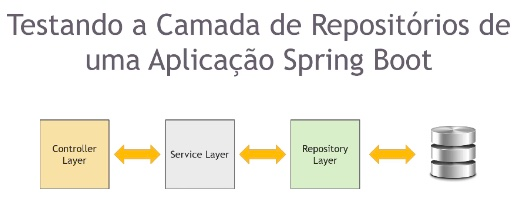

### Nesta sessão, vamos mergulhar em uma série de tópicos que irão expandir nosso conhecimentos sobre o desenvolvimento de aplicações com o Spring Boot.

## 📌 Tópicos abordados

### 🔹 Notação `@DataJpaTest`
A notação `@DataJpaTest` é muito útil para testar o comportamento de repositórios JPA. Ela configura um ambiente mínimo necessário para testar a camada de persistência, desativando componentes desnecessários, como controllers e serviços.

### 🔹 Uso do Banco de Dados em Memória (H2)
Aprenderemos como reestruturar nossa aplicação para suportar um banco de dados em memória usando o **H2**. Isso permitirá executar testes mais rápidos e independentes do banco de dados real.

### 🔹 Testando operações CRUD
Exploraremos como testar as principais operações de **Create, Read, Update e Delete (CRUD)** de forma automatizada. Isso garante a consistência dos dados e a funcionalidade correta das operações.

### 🔹 Testando consultas personalizadas
Aprenderemos a testar a operação de busca de pessoas por e-mail usando o recurso de **Query Methods** do Spring Data JPA. Também veremos como definir consultas personalizadas e validar os resultados corretamente.

Cada tópico será acompanhado de **exemplos práticos** e **discussões teóricas** para facilitar a compreensão.

---

# 📌 Testando Repositórios no Spring Boot

## 📖 Introdução

Nessa aula, iremos aprender os **conceitos por trás dos testes de repositórios**.

## 🏗 Arquitetura da Aplicação

Abaixo, temos uma arquitetura típica de uma aplicação **Spring Boot MVC**, onde diferentes camadas se comunicam:
 

- **Controller Layer** → Responsável por receber requisições HTTP e interagir com a camada de serviços.
- **Service Layer** → Contém a lógica de negócio da aplicação.
- **Repository Layer** → Gerencia a persistência dos dados, interagindo com o banco de dados.
- **Database** → Armazena as informações e é acessado pela camada de repositórios.

📌 Essa estrutura permite **separação de responsabilidades** e facilita a manutenção do código.

---

# Testando Repositórios com @DataJpaTest no Spring Boot

## Introdução
Ao testar a camada de repositório, não testamos a **Service Layer** nem a **Controller Layer**. Nosso objetivo é isolar os testes da camada **Repository** sem precisar de um banco de dados real.

Para isso, utilizamos a anotação `@DataJpaTest`, que sobe um banco de dados em memória, o **H2**, para testar nossos repositórios.

## Como funciona o @DataJpaTest?
O `@DataJpaTest` configura automaticamente um banco de dados em memória para testes, sem a necessidade de um banco real.

Diferente de outras abordagens, aqui **não utilizamos o Mockito**, pois não há necessidade de mockar a camada de repositório. O próprio `@DataJpaTest` se encarrega de configurar o ambiente adequado.

## Vantagens do @DataJpaTest
- **Focado na camada de persistência**: O Spring Boot fornece essa anotação para testar os componentes da camada de persistência ou repositório.
- **Carregamento leve e rápido**: Apenas os beans necessários para testes são carregados, como as entidades anotadas com `@Entity` e os repositórios anotados com `@Repository`. Outros beans, como `@Component`, `@Service` e `@Controller`, **não são carregados**, tornando os testes mais eficientes.
- **Execução transacional**: Os testes anotados com `@DataJpaTest` são **transacionais por padrão**, garantindo que qualquer alteração feita no banco em memória seja revertida ao final do teste. Isso evita que um teste afete o resultado de outro, mantendo o ciclo de vida esperado do JUnit.

## Estrutura do Teste
Ao utilizar `@DataJpaTest`, o Spring Boot:
1. Identifica as classes anotadas com `@Entity`.
2. Configura os repositórios do **Spring Data JPA**.
3. Cria um banco de dados H2 em memória.
4. Executa os testes de maneira isolada, garantindo a integridade do ambiente.

## Considerações Finais
Apesar de ser uma abordagem eficaz para testes unitários de repositórios, o uso de um banco de dados em memória pode ter **desvantagens** em relação a bancos reais. Esse ponto será abordado mais adiante.

Por enquanto, essa é a abordagem que utilizaremos para testar a camada de repositório no **Spring Boot** utilizando **Spring Data JPA**.
________________________________________________________________________________________________________________________

# 📌 Testando Serviços com Mockito no Spring Boot

## Introdução
Agora que aprendemos a testar nossos repositórios, vamos focar nos testes da camada de **serviços**.

Diferente dos repositórios, onde utilizamos a anotação `@DataJpaTest` para criar um banco de dados em memória e **não usamos o Mockito**, nos testes de serviços **utilizaremos o Mockito**.

## Anotações Utilizadas
Para isso, utilizamos duas anotações do Mockito que já conhecemos:

- **`@Mock`**: Cria um mock (objeto simulado) de uma classe ou interface.
- **`@InjectMocks`**: Injeta os mocks criados em uma instância da classe que está sendo testada.

Quando queremos injetar um objeto mockado em outro objeto mockado, usamos `@InjectMocks`. Essa anotação cria uma instância real da classe e injeta os mocks configurados com `@Mock`.

## Estrutura do Teste
Nos testes da camada de serviço, precisamos:
1. Criar um **mock do repositório**.
2. Injetar esse mock na **classe de serviço** utilizando `@InjectMocks`.
3. Adicionar a extensão **MockitoExtension** para gerenciar os mocks corretamente.

Dessa forma, conseguimos testar a lógica da camada de serviço sem depender de um banco de dados real.

## Diferença entre Testes de Repositório e Serviço
- **Repositório (`@DataJpaTest`)**: Utiliza um banco de dados em memória (H2) e **não usa o Mockito**.
- **Serviço (Mockito)**: Não precisa de um banco de dados, pois usamos mocks para simular dependências.

## Considerações Finais
O uso do Mockito nos permite testar a lógica de negócios sem precisar carregar todo o contexto da aplicação. Essa abordagem torna os testes mais rápidos e eficientes, garantindo que a camada de serviço funcione corretamente antes de integrá-la com outras partes do sistema.
-------------------------------------------------------------------------------------------------------------------------------------------------
_________________________________________________________________________________________________________________________________________

# 🧪 Testando Controllers no Spring Boot

## 📌 Visão Geral
Durante essas aulas, vamos começar com uma visão geral dos testes de controllers e entender a importância de testar essa camada da nossa aplicação.

Em seguida, vamos comparar duas anotações utilizadas para testes de controllers no Spring Boot.

## 🔍 Comparação: `@WebMvcTest` vs `@SpringBootTest`
O **Spring Boot** fornece a anotação `@WebMvcTest` para testar controllers **Spring MVC**.  
Além disso, os testes baseados em `@WebMvcTest` são **mais rápidos**, pois carregam apenas o **controller especificado** e suas dependências, sem carregar a aplicação inteira.

- O **Spring Boot** instancia apenas a **camada web**, em vez de todo o **Application Context**.
- Em uma aplicação com vários controllers, você pode definir a instanciação de apenas um deles usando, por exemplo:
  ```java
  @WebMvcTest(PersonController.class)

## Testando as Operações
Nos testes, colocaremos em prática o que aprendemos testando as operações mais comuns em nossos controladores.

### 🛠️ Operação de Criação (Create)
- Garantir que os dados sejam enviados corretamente.

### 🔍 Operação de Busca (Find All)
- Verificar se os resultados são retornados conforme esperado.

### 🔎 Operação de Busca por ID (Find by ID)
- Testar cenários positivos e negativos (registros existentes e inexistentes).

### ✏️ Operação de Atualização (Update)
- Testar em cenários positivos e negativos.

### 🗑️ Operação de Exclusão (Delete)
- Garantir que os recursos sejam removidos adequadamente.
- 
### **JSONPath Library**
Utilizaremos a **JSONPath Library**, que é uma **DSL para leitura de documentos JSON**, para fazer as **asserções** em nossos testes.

- JSONPath é uma ferramenta semelhante ao **XPath**, usada para XML, mas voltada para **JSON**.
- No **JSONPath**, o objeto raiz sempre é referenciado com um **`$` (cifrão)**, independentemente de ser um objeto ou um array.

### 🔎 Exemplo de Uso do JSONPath
Se tivermos o seguinte JSON:
```json
{
  "firstName": "Leandro",
  "lastName": "Dohler"
}
```
Podemos acessar as propriedades usando JSONPath:
```{
$.firstName   // Retorna "Leandro"
$.lastName    // Retorna "Dohler"
}
```
Se quisermos acessar o segundo elemento de um array, usaríamos:
````
$.items[1]   // Retorna o segundo item do array "items"
````

## 🔧 Ferramentas Utilizadas

### `@WebMvcTest`
A anotação `@WebMvcTest` permite testar **controllers Spring MVC** sem carregar toda a aplicação.  
Ela nos ajuda a focar exclusivamente na camada de **controller** e suas interações.

### **Mockito**
Usaremos o **Mockito** para criar objetos simulados (**mocks**) e testar os controllers isoladamente.

### **JSONPath Library**
Utilizaremos a **JSONPath Library**, que é uma **DSL para leitura de documentos JSON**, para fazer as **asserções** em nossos testes.  
_______________________________________________________________________________________________________________________

## Testes de Integração com Spring Boot

Nesta seção, iremos explorar os testes de integração utilizando o Spring Boot.

Durante essa jornada, vamos aprender sobre diferentes ferramentas e técnicas para garantir a qualidade e o bom funcionamento dos nossos endpoints.

### Visão Geral

Iniciaremos com uma visão geral dos testes de integração, compreendendo sua importância no desenvolvimento de aplicações.

Como o nome sugere, os testes de integração têm foco na integração de diferentes camadas da aplicação. Isso também significa que não há uso de mocks. Basicamente, escrevemos testes de integração para validar funcionalidades que podem envolver interação com múltiplos componentes.

### Annotation `@SpringBootTest`

Vamos explorar a annotation `@SpringBootTest`, uma poderosa notação fornecida pelo Spring Boot para facilitar a criação e execução de testes de integração.

Essa anotação inicializa um servidor embarcado, cria um web environment e possibilita que os métodos anotados com `@Test` executem testes de integração.

Por padrão, `@SpringBootTest` não inicia um servidor. Para definir como os testes serão executados, precisamos adicionar o atributo `webEnvironment`. As principais opções disponíveis são:

- **MOCK (Padrão)**: Carrega um `WebServerApplicationContext` e fornece um web environment mockado.
- **RANDOM_PORT**: Carrega um `WebServerApplicationContext` e fornece um web environment real. O servidor embarcado é iniciado e exposto em uma porta aleatória. Essa opção deve ser usada para testes de integração.
- **DEFINED_PORT**: Carrega um `WebServerApplicationContext` e fornece um web environment real em uma porta predefinida.
- **NONE**: Carrega um `ApplicationContext` usando o `SpringApplication`, mas não fornece nenhum web environment.

### Documentação com Swagger / OpenAPI

Conheceremos o Swagger (OpenAPI) e veremos como utilizá-lo para documentar e testar nossos endpoints de forma eficiente e automatizada. Também abordaremos a configuração básica do Swagger em nosso projeto, permitindo que ele gere a documentação automaticamente.

Para isso, utilizaremos a dependência `SpringDoc OpenAPI Starter WebMVC UI`, que facilita a criação e exibição da documentação interativa.

### Ferramentas Essenciais para Testes de Integração

- **MVN REPOSITORY**: Site para buscar dependências do `pom.xml`, incluindo bibliotecas essenciais para os testes de integração.
- **TestContainers**: Exploraremos como o TestContainers pode nos ajudar a preparar a infraestrutura necessária para executar nossos testes, garantindo um ambiente isolado e controlado.
- **Validação do Swagger**: Verificaremos a geração da documentação do Swagger e sua integração com o TestContainers e Azure, garantindo que os endpoints estejam funcionando conforme esperado.

### Configuração de Beans no Spring

No Spring, um **Bean** é um objeto que é instanciado, montado e gerenciado pelo container do Spring. O container do Spring busca informações em XML, anotações ou código Java sobre como os beans devem ser instanciados, configurados e montados, além de como eles se relacionam com outros beans. Esse processo é conhecido como **injeção de dependências**.

Se você cria uma classe que depende de um bean, só precisa se preocupar com o que sua classe necessita, sem se preocupar com as dependências dela.

Existem diferentes formas de criar beans no Spring:
- Anotando classes com `@Component`, `@Service` ou `@Configuration` para que sejam gerenciadas pelo Spring.
- Usando a anotação `@Bean` em um método para tornar a instância retornada um objeto gerenciado pelo Spring, seja de uma classe própria ou de terceiros.

Essas classes que, do ponto de vista do Spring, são os beans, representam as regras de funcionamento da sua aplicação.

### Configuração do OpenAPI no Projeto

Para configurar a documentação da API com OpenAPI, utilizamos uma classe de configuração:

```java
import io.swagger.v3.oas.models.OpenAPI;
import io.swagger.v3.oas.models.info.Info;
import io.swagger.v3.oas.models.info.License;
import org.springframework.context.annotation.Bean;
import org.springframework.context.annotation.Configuration;

@Configuration
public class OpenAPIConfig {

    @Bean // BEAN É UM OBJETO QUE É INSTANCIADO, MONTADO E GERENCIADO PELO CONTAINER DO SPRING.
    public OpenAPI customOpenAPI() {
        return new OpenAPI()
            .info(new Info()
                .title("Hello Swagger OpenAPI")
                .version("v1")
                .description("Some description about your API.")
                .termsOfService("http://pub.erudio.com.br/meus-cursos")
                .license(new License()
                    .name("Apache 2.0")
                    .url("http://pub.erudio.com.br/meus-cursos")
                )
            );
    }
}
```

Essa classe usa `@Configuration` para definir que contém configurações do Spring e `@Bean` para disponibilizar a instância de `OpenAPI` como um bean gerenciado pelo Spring.

### Testes de Repositórios e Banco de Dados

Removemos o banco de dados H2 para criar testes de integração mais realistas, garantindo que a aplicação seja testada em um ambiente próximo ao de produção.

Convertendo nossos testes de repositórios em testes de integração, interagindo diretamente com o banco de dados e validando o comportamento do código em um ambiente mais próximo do mundo real.

### Testando Endpoints do `PersonController`

Prepararemos a infraestrutura de testes para os endpoints de `PersonController`, validando as seguintes operações:

- **Create**
- **Update**
- **FindById**
- **FindAll**
- **Delete**
______________________________________________________________________________________________________________________

### Resolvendo Problema com `Jakarta Bean Validation`

Após a criação da classe de testes e adição das dependências, ao iniciar a aplicação, encontramos um erro. O Jakarta Bean Validation não conseguiu encontrar um provider para o Hibernate Validator.

Para resolver esse problema, basta adicionar a dependência `Spring Boot Starter Validation` no `pom.xml`. Embora possamos utilizar diretamente o Hibernate Validator, é mais interessante usar a versão integrada ao Spring Boot, pois futuras atualizações do framework já incluirão quaisquer mudanças necessárias automaticamente.

```xml
<dependency>
    <groupId>org.springframework.boot</groupId>
    <artifactId>spring-boot-starter-validation</artifactId>
</dependency>
```

Após adicionar essa dependência e reiniciar a aplicação, o erro será resolvido e o Swagger estará acessível no navegador.

### Validação do Swagger

Após iniciar a aplicação com sucesso, podemos abrir o navegador e acessar `http://localhost:8080/swagger-ui/index.html` para visualizar a documentação do Swagger. As propriedades configuradas serão refletidas na interface do Swagger.

Além disso, podemos testar nossa API diretamente pelo Swagger, verificando os endpoints e as respostas retornadas.

### Criando Testes de Integração

Nos próximos passos, iremos criar um teste de integração para garantir que o Swagger foi gerado corretamente e que os endpoints estão funcionando conforme esperado.


